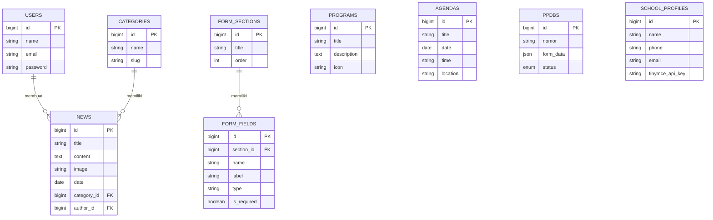

# 🏫 WebSekolah - Sistem Informasi Akademik & PPDB Terpadu


**WebSekolah** adalah platform website sekolah modern dan responsif yang dibangun menggunakan framework Laravel. Aplikasi ini dirancang untuk memenuhi kebutuhan informasi publik, pendaftaran siswa baru (PPDB) dinamis, dan sistem manajemen konten (CMS) yang mudah digunakan oleh pihak sekolah.

---

## 📸 Tinjauan Visual (Preview)

Berikut adalah beberapa penampakan antarmuka dari WebSekolah:

<div align="center">
  <br>
  <h3>🖥️ Halaman Beranda (Frontend)</h3>
  
  <p><i>Halaman depan publik dengan desain modern menggunakan Tailwind CSS.</i></p>

  <br>
  <h3>🎛️ Panel Admin (Backend)</h3>
  
  <p><i>Dashboard admin menggunakan AdminLTE 3 untuk manajemen data sekolah.</i></p>

  <br>
  <h3>📝 Formulir PPDB Dinamis</h3>
  
  <p><i>Formulir pendaftaran siswa baru yang field-nya bisa di-custom dari panel admin.</i></p>
</div>

---

## 📑 Product Requirements Document (PRD)

### 1. Tujuan Produk
Membangun platform digital terpusat untuk instansi pendidikan (sekolah) guna mempermudah penyebaran informasi kepada wali murid dan masyarakat, serta melakukan digitalisasi proses Penerimaan Peserta Didik Baru (PPDB) menjadi 100% *online* dan *paperless*.

### 2. Target Pengguna
- **Calon Siswa / Wali Murid:** Mencari informasi sekolah dan mendaftar PPDB.
- **Masyarakat Umum:** Membaca berita, agenda, dan melihat profil sekolah.
- **Admin / Humas Sekolah:** Mengelola konten *website* dan menyeleksi data pendaftar PPDB.

### 3. Fitur Utama (Core Features)

#### Bagian Frontend (Publik)
- **Beranda Interaktif:** Hero banner, statistik, sambutan kepala sekolah, agenda terdekat, fasilitas, dan berita terbaru.
- **Sistem PPDB Dinamis:** Formulir pendaftaran cerdas yang kolom inputnya (text, file, select) ditentukan dari panel Admin (Form Builder).
- **Cek Status PPDB:** Wali murid dapat mengecek status kelulusan secara mandiri bermodalkan Nomor Pendaftaran.
- **Multi-bahasa (I18n):** Dukungan pergantian bahasa untuk konten dinamis (Spatie Translatable).
- **SEO & Performa Tinggi:** Meta tags otomatis, sitemap XML otomatis, kompresi gambar (WebP), dan *Lazy Loading*.

#### Bagian Backend (Admin Panel)
- **CMS Intuitif:** Manajemen Berita, Program Unggulan, Agenda, Fasilitas, Galeri, Testimoni, dan Video Profil.
- **Form Builder PPDB:** Memungkinkan admin menambah/mengurangi/mengedit kolom isian pendaftaran siswa tanpa menyentuh *coding*.
- **Manajemen Seleksi:** Filter, verifikasi, dan ubah status calon siswa (Diterima/Ditolak/Menunggu).
- **Bulk Action:** Menghapus atau memodifikasi banyak data sekaligus dalam satu klik.
- **Pengaturan Dinamis:** Integrasi API Key TinyMCE, nama sekolah, kontak, logo, semuanya dari *database*.

---

## 🗄️ Database Architecture

### 1. Entity Relationship Diagram (ERD)

Diagram di bawah ini menggambarkan relasi antar *entity* utama di dalam *database*:



### 2. Logical Record Structure (LRS)

Tabel di bawah ini merepresentasikan struktur logika fisik antar tabel (*keys*) di *database*:

| Nama Tabel | Primary Key (PK) | Foreign Key (FK) | Kolom Penting Lainnya | Relasi |
| :--- | :--- | :--- | :--- | :--- |
| **users** | `id` | - | `name`, `email`, `password` | 1-to-N ke `news` |
| **categories** | `id` | - | `name`, `slug` | 1-to-N ke `news` |
| **news** | `id` | `author_id` (users.id), `category_id` (categories.id) | `title`, `slug`, `content`, `image`, `date` | N-to-1 ke `users` & `categories` |
| **programs** | `id` | - | `title`, `description`, `icon` | - |
| **agendas** | `id` | - | `title`, `date`, `time`, `location` | - |
| **facilities**| `id` | - | `title`, `description`, `image_path` | - |
| **galleries** | `id` | - | `title`, `image_path` | - |
| **ppdbs** | `id` | - | `nomor`, `status`, `form_data` (JSON) | Independen (Menyimpan Payload Dinamis) |
| **form_sections** | `id` | - | `title`, `order` | 1-to-N ke `form_fields` |
| **form_fields** | `id` | `section_id` (form_sections.id) | `name`, `label`, `type`, `is_required` | N-to-1 ke `form_sections` |
| **school_profiles** | `id` | - | `tinymce_api_key`, `address`, `phone` | Tabel Tunggal (Setting) |

---

## 🚀 Cara Instalasi (Deployment)

Ikuti langkah-langkah di bawah ini untuk menjalankan *project* ini di *local environment* Anda.

### Prasyarat
- PHP >= 8.2
- Composer
- Node.js & NPM
- MySQL / MariaDB

### Langkah-langkah:
1. **Kloning Repositori**
   ```bash
   git clone https://github.com/username/websekolah.git
   cd websekolah
   ```

2. **Instalasi Dependensi PHP**
   ```bash
   composer install
   ```

3. **Konfigurasi Lingkungan (.env)**
   ```bash
   cp .env.example .env
   ```
   *Buka file `.env` dan sesuaikan kredensial koneksi ke database Anda (DB_DATABASE, DB_USERNAME, DB_PASSWORD).*

4. **Generate Application Key**
   ```bash
   php artisan key:generate
   ```

5. **Migrasi Database & Seeder Dummy Data**
   *(Seeder ini otomatis akan membuat akun Admin dan ratusan data dummy untuk berita, galeri, agenda, dll)*
   ```bash
   php artisan migrate:fresh --seed
   ```

6. **Tautkan Storage (Symlink)**
   Agar gambar yang diunggah dapat diakses dari URL publik:
   ```bash
   php artisan storage:link
   ```

7. **Kompilasi Aset Frontend (Tailwind & JS)**
   ```bash
   npm install
   npm run build
   ```

8. **Jalankan Server Lokal**
   ```bash
   php artisan serve
   ```
   Website kini dapat diakses di: `http://localhost:8000`

### 🔑 Akses Administrator
- **Email:** `admin@sekolah.com`
- **Password:** `password`

---

## 🛠️ Tech Stack & Library

- **Framework Backend:** Laravel 11.x
- **Frontend Utama:** Blade Template Engine + Tailwind CSS + Alpine.js
- **Panel Admin:** AdminLTE 3 + Bootstrap 4
- **Tabel Data:** DataTables + Responsive Extension
- **Notifikasi:** SweetAlert2 + Toastr
- **Multi Bahasa:** `spatie/laravel-translatable`
- **Teks Editor:** TinyMCE 6 (Cloud via API Key)
- **Ikon:** FontAwesome 6

---
*Dibuat dengan ❤️ oleh Tim Pengembang.*
